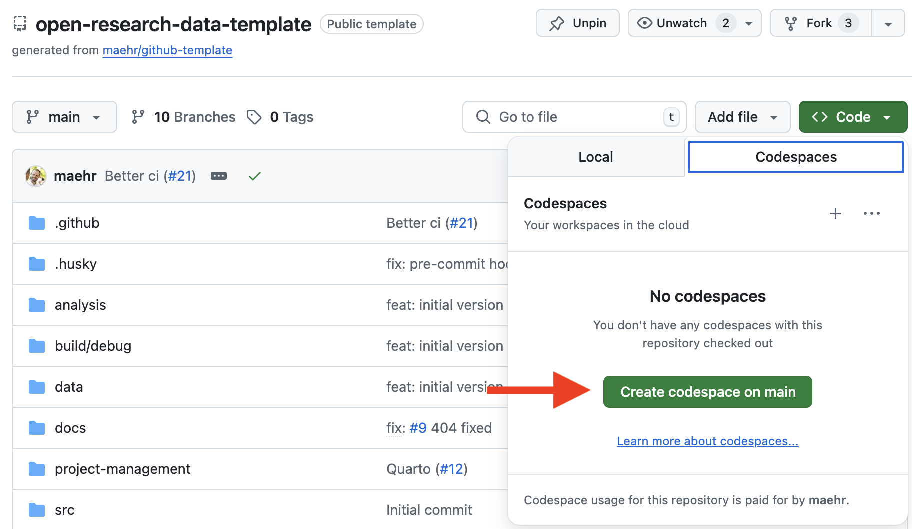

# Seeing History Unseen: CHR 2025 Conference Materials

This repository contains the abstract and presentation materials for the CHR 2025 conference paper "Seeing History Unseen: Evaluating Vision-Language Models for WCAG-Compliant Alt-Text in Digital Heritage Collections" by Moritz Mähr (University of Bern and Basel) and Moritz Twente (University of Basel).

[](https://github.com/maehr/chr2025-seeing-history-unseen/issues)
[](https://github.com/maehr/chr2025-seeing-history-unseen/network)
[](https://github.com/maehr/chr2025-seeing-history-unseen/stargazers)
[](https://github.com/maehr/chr2025-seeing-history-unseen/blob/main/LICENSE-AGPL.md)
[](https://github.com/maehr/chr2025-seeing-history-unseen/blob/main/LICENSE-CCBY.md)
[](https://zenodo.org/badge/latestdoi/ZENODO_RECORD)

## About This Repository

This repository hosts the conference materials for CHR 2025 (Conference on Computational Humanities Research) including:

- **Abstract**: A LaTeX document containing the complete abstract for our paper
- **Presentation Materials**: Slides and supporting materials for the conference presentation
- **Documentation**: Supporting documentation and setup instructions

## Research Overview

Our research explores the feasibility, accuracy, and ethics of using state-of-the-art vision-language models to generate WCAG-compliant alt-text for heterogeneous digital heritage collections. We combine computational experiments with qualitative evaluation to develop a framework for responsible AI-assisted accessibility in the humanities.

### Key Research Questions

1. **Feasibility**: Can current vision-language models produce useful, WCAG 2.2–compliant alt-text for complex historical images when provided with contextual metadata?
2. **Quality and Authenticity**: How do domain experts rate AI-generated image descriptions in terms of factual accuracy, completeness, and usefulness for understanding historical content?
3. **Ethics and Governance**: What are the ethical implications of using AI to generate alt-text in heritage collections, and what human oversight or policy safeguards are required for responsible use?

## Repository Structure

- `abstract/`: Contains the LaTeX source, class files, and bibliography for the conference abstract
- `presentation/`: Will contain presentation slides and supporting materials
- `documentation/`: Additional documentation and resources
- `src/benchmarking/`: Python module for benchmarking vision-language models via OpenRouter API

## Installation

We recommend using **[GitHub Codespaces](https://github.com/features/codespaces)** for a reproducible setup.

## Getting Started

### For Most Users: Reproducible Setup with GitHub Codespaces

1. **[Use this template](https://github.com/new?template_name=open-research-data-template&template_owner=maehr)** for your project in a new repository on your GitHub account.

   <div align="center">
     
   </div>

2. Click the green **`<> Code`** button at the top right of this repository.

3. Select the **“Codespaces”** tab and click **“Create codespace on `main`”**.
   GitHub will now build a container that includes:
   - ✅ Node.js (via `npm`)
   - ✅ Python with `uv`
   - ✅ R with `renv`
   - ✅ Quarto

   <div align="center">
     
   </div>

4. Once the Codespace is ready, open a terminal and preview the documentation:

   ```bash
   uv run quarto preview
   ```

   <div align="center">
     
   </div>

> **Note:** All dependencies (Node.js, Python, R, Quarto) are pre-installed in the Codespace.

<details>
<summary>👩‍💻 <strong>Advanced</strong> Local Installation</summary>

#### Prerequisites

- [Node.js](https://nodejs.org/en/download/)
- [R](https://cran.r-project.org/) and Rtools (on Windows)
- [uv (Python manager)](https://github.com/astral-sh/uv#installation)
- [Quarto](https://quarto.org/docs/get-started/)

> _Note: `uv` installs and manages the correct Python version automatically._

#### Local Setup Steps

```bash
# 1. Install Node.js dependencies
npm install
npm run prepare

# 2. Setup Python environment
uv sync

# 3. Setup R environment
Rscript -e 'install.packages("renv"); renv::restore()'

# 4. Preview documentation
uv run quarto preview
```

</details>

## Use

### Building the Abstract

To build the LaTeX abstract:

```bash
cd abstract
make paper
```

### Development Commands

Check that all files are properly formatted:

```bash
npm run check
```

Format all files:

```bash
npm run format
```

Run the wizard to write meaningful commit messages:

```bash
npm run commit
```

Generate a changelog:

```bash
npm run changelog
```

### VLM Benchmarking

The repository includes a Python module for benchmarking vision-language models via the OpenRouter API. This tool supports the research by providing systematic evaluation of VLM performance on alt-text generation tasks.

#### Quick Start

1. Install Python dependencies with uv:

```bash
uv sync
```

2. Set up your OpenRouter API key in a `.env` file:

```bash
cp example.env .env
# Edit .env to add your OPENROUTER_API_KEY
```

3. List available VLM models:

```bash
uv run python -m src.benchmarking list-models
```

4. Benchmark a specific model:

```bash
uv run python -m src.benchmarking benchmark --model "openai/gpt-4-vision-preview" --task-set wcag
```

For detailed documentation, see [src/benchmarking/README.md](https://github.com/maehr/chr2025-seeing-history-unseen/blob/main/src/benchmarking/README.md).

## Support

This project is maintained by [@maehr](https://github.com/maehr). Please understand that we can't provide individual support via email. We also believe that help is much more valuable when it's shared publicly, so more people can benefit from it.

| Type                                   | Platforms                                                                                |
| -------------------------------------- | ---------------------------------------------------------------------------------------- |
| 🚨 **Bug Reports**                     | [GitHub Issue Tracker](https://github.com/maehr/chr2025-seeing-history-unseen/issues)    |
| 📚 **Docs Issue**                      | [GitHub Issue Tracker](https://github.com/maehr/chr2025-seeing-history-unseen/issues)    |
| 🎁 **Feature Requests**                | [GitHub Issue Tracker](https://github.com/maehr/chr2025-seeing-history-unseen/issues)    |
| 🛡 **Report a security vulnerability** | See [SECURITY.md](SECURITY.md)                                                           |
| 💬 **General Questions**               | [GitHub Discussions](https://github.com/maehr/chr2025-seeing-history-unseen/discussions) |

## Roadmap

- [ ] Complete the conference abstract and presentation preparation
- [ ] Create presentation slides for CHR 2025
- [ ] Finalize user study design and implementation
- [ ] Publish dataset and benchmark for future research

## Contributing

Please see [CONTRIBUTING.md](CONTRIBUTING.md) for details on our code of conduct and the process for submitting pull requests.

## Authors and credits

- **Moritz Mähr** - _University of Bern & Basel_ - [maehr](https://github.com/maehr)
- **Moritz Twente** - _University of Basel_ - [moritztwente](https://github.com/mtwente)

See also the list of [contributors](https://github.com/maehr/chr2025-seeing-history-unseen/graphs/contributors) who contributed to this project.

## License

The abstract, presentation materials, and documentation in this repository are released under the Creative Commons Attribution 4.0 International (CC BY 4.0) License - see the [LICENSE-CCBY](LICENSE-CCBY.md) file for details. By using these materials, you agree to give appropriate credit to the original author(s) and to indicate if any modifications have been made.

Any code in this repository is released under the GNU Affero General Public License v3.0 - see the [LICENSE-AGPL](LICENSE-AGPL.md) file for details.
