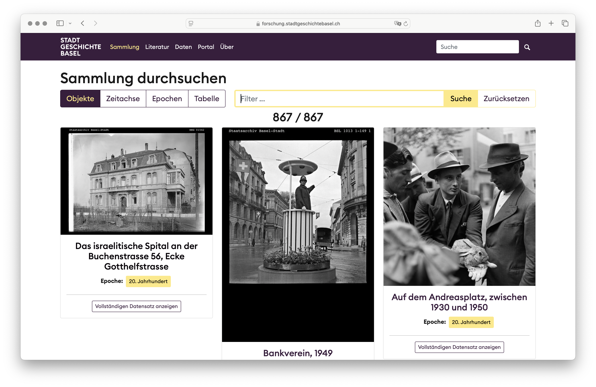
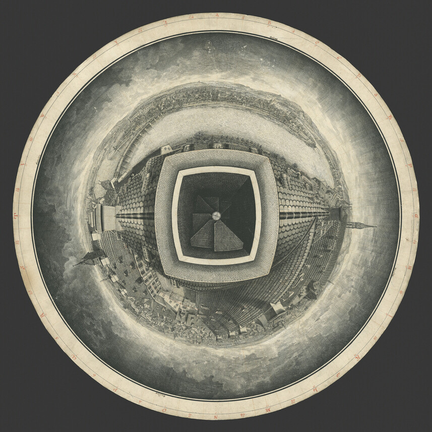
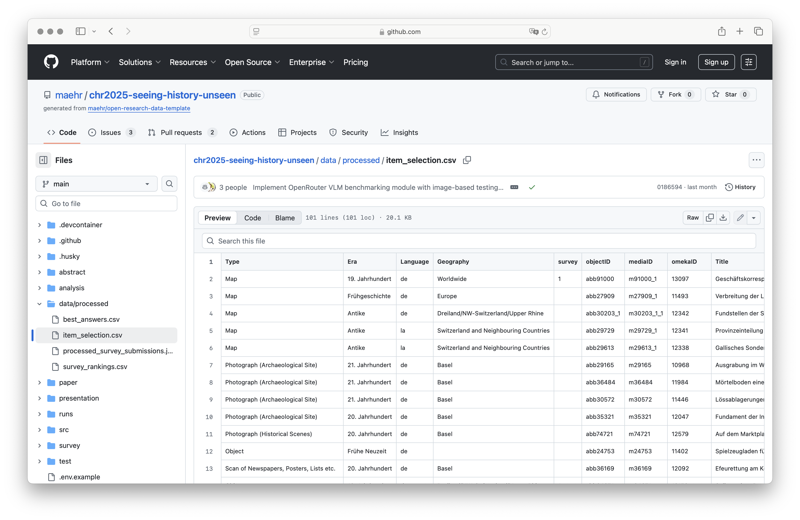
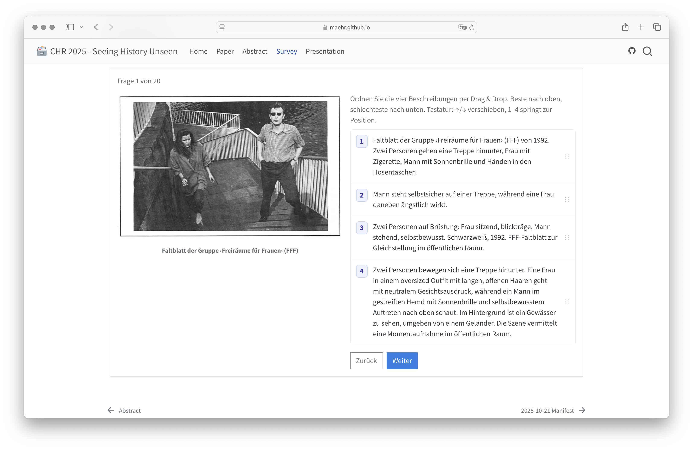

# {#seeing-history-unseen-intro data-menu-title="Seeing History Unseen Intro"}

::: header
Seeing History Unseen
:::

::: {.center-text}
Evaluating vision–language models (VLMs) for alt-text in digital heritage collections
:::

::: {.column width="50%"}
*Case Study*
:::

:::: {.column width="50%"}

::: {.right-justify}
*Focus*
:::

::::

::::: {.fragment}

:::: {.column width="50%"}
Stadt.Geschichte.Basel Open Research Data Platform
::::

:::: {.column width="50%"}

::: {.right-justify}
WCAG-compliant, historically informed alt-text for heterogeneous images 
:::

::::

:::::

# {#accessibility-gap data-menu-title="Accessibility Gapppp"}

::: header
Motivation: Accessibility Gap
:::

- Digitized archives still exclude blind and low-vision users
- Many images lack meaningful alt-text or rely on minimal, generic captions
- Alt-text is not just a technical requirement but part of historical justice
- Rich descriptions also benefit other groups (e.g., neurodivergent readers)

# {#alt-text-digital-heritage data-menu-title="Alt-Text in Digital Heritage"}

::: header
Alt-Text in Digital Heritage
:::

- Alt-text translates visual evidence into language
- Production is labor-intensive; often postponed or dropped entirely
- Requires:
  - Domain knowledge (history, archives, local context)
  - Accessibility expertise (WCAG, screenreader use)
  - Editorial judgement (what is salient, what is harmful)

# {#opportunity-and-risks data-menu-title="Opportunity and Risks of VLMs"}

::: header
Opportunity and Risks of VLMs
:::

- Multimodal models can caption images at scale (e.g., GPT-4o mini, Gemini, Llama, Qwen)
- Promises

  ::: {.fragment}
  - High coverage, fast throughput, low marginal cost
  - Potential to *fill the gap* for large collections
  :::

- Risks

  ::: {.fragment}
  - Hallucinations, misrecognitions, and subtle biases
  - Uncritical reproduction of harmful terminology from sources or training data
  :::

# {#rq data-menu-title="Research Questions"}

::: header

Research Questions

:::

- **RQ1 — Feasibility**
  - What coverage, throughput, and unit cost can current VLMs achieve for WCAG-aligned alt-text on a heterogeneous heritage corpus?
- **RQ2 — Relative quality**
  - How do humanities experts rank model outputs?
  - Which error patterns recur in ‹best› alt-texts?

# {#corpus-data data-menu-title="Corpus and Dataset"}

::: header
Corpus and Dataset
:::

:::  {.column width="40%"}

:::

:::  {.column width="60%"}
 
Stadt.Geschichte.Basel [Open Research Data Platform](https://forschung.stadtgeschichtebasel.ch)

≈1900 media objects (as of Dec 2025)
:::

- Media Types: photographs, maps, drawings, objects, diagrams, ephemera
- Time Periods: from prehistoric to contemporary Basel
- Complexity: multi-part figures, text-heavy items

<!-- ::::: {.content-visible when-format="html"}

# {#corpus-examples data-menu-title="Corpus and Dataset Examples"}

::: header
Corpus and Dataset
:::

:::: {.r-stack .nostretch}

::: {fig-align="center" style="width: 50%;"}

:::

::: {fig-align="center" style="width: 45%;"}
{.fragment}
:::

::: {fig-align="center" style="width: 60%;"}
{.fragment}
:::

::: {fig-align="center" style="width: 60%;"}
{.fragment}
:::

::::

::::: -->

# {#corpus-examples-1 data-menu-title="Corpus and Dataset Examples" data-background-image="images/abb13184_small.jpg"}

# {#corpus-examples-2 data-menu-title="Corpus and Dataset Examples" data-background-image="images/abb22924_thumb.jpg"}

# {#corpus-examples-3 data-menu-title="Corpus and Dataset Examples" data-background-image="images/abb37030_small.jpg"}

# {#corpus-examples-4 data-menu-title="Corpus and Dataset Examples" data-background-image="images/abb90429_small.jpg"}

<!-- # {#study-data data-menu-title="Corpus and Dataset (Study Datasets)"}

::: header
Corpus and Dataset
:::

::: {style="width: 70%; display: block; margin: auto;"}
{width="60%"}
:::

::: {.center-text}
100-item benchmark set (released with the paper)

20-item subset for detailed expert evaluation
::: -->

# {#study-data-fullscreen data-menu-title="Dataset and Survey Subset" data-background-image="images/screenshot_dataset.png"}

# {#models data-menu-title="Models under Study"}

::: header
Models under Study
:::

- Four vision–language models via OpenRouter:
  - **Google Gemini 2.5 Flash Lite**
  - **Meta Llama 4 Maverick**
  - **OpenAI GPT-4o mini**
  - **Qwen 3 VL 8B Instruct**
- Selection criteria:
  - Mix of proprietary and open-weight models
  - Similar cost range and context window
  - Multimodal and multilingual (incl. German)

# {#prompt-design-system data-menu-title="Prompt and Pipeline Design (System Prompt)"}

::: header
Prompt and Pipeline Design
:::

- Fixed, WCAG-aligned system prompt
  - Short, neutral, factual descriptions
  - No “image of …”, no `alt=` wrappers, no emojis
  - Length targets
    - 90–180 characters
    - up to 400 for complex charts
  - Rules for portraits, objects, documents, maps, event photos

# {#prompt-design-user data-menu-title="Prompt and Pipeline Design (User Prompt)"}

::: header
Prompt and Pipeline Design
:::

- User prompt
  - Concise, structured metadata (title, description, date, era, creator, publisher, source)
  - Image URL at the end

::: {.fragment}
- Pipeline:
  - Standardized JPG (800×800) + JSON metadata &rarr; 4 candidate alt-texts per image
:::

<!-- # {#ranking-study data-menu-title="Expert Ranking Study (Setup)"}

::: header
Expert Ranking Study
:::

::: {style="width: 70%; display: block; margin: auto;"}

:::

::: {.center-text}
Task: For each of the 20 images, rank 4 model outputs from **1 (best) to 4 (worst)**
::: -->

# {#study-setup data-menu-title="Expert Ranking Study (Setup)" data-background-image="images/screenshot_survey.png"}

# {#ranking-study2 data-menu-title="Expert Ranking Study (Instructions)"}

::: header
Expert Ranking Study
:::

- Participants: 21 humanities scholars

- Instructions:
  - For each of the 20 images, rank 4 model outputs from **1 (best) to 4 (worst)**
  - Focus on WCAG-aligned criteria:
    - Core visual content, no redundancy
    - Salient features and visible text
    - Context only when it aids understanding
  - Factual accuracy and bias not foregrounded but may influence judgement

# {#rq1-results data-menu-title="RQ1 -- Feasibility Results"}

::: header
RQ1 -- Feasibility Results
:::

- **Coverage**

  ::: {.fragment}
  - All four models produced non-empty alt-text for all 20 images → **100% coverage**
  :::

- **Latency and throughput**

  ::: {.fragment}
  - ≈2–4 seconds per item; ≈0.24–0.43 items/s
  - Qwen 3 VL 8B: fastest; GPT-4o mini: slower but stable
  :::

- **Cost**

  ::: {.fragment}
  - ≈1.8×10⁻⁴ to 3.6×10⁻³ USD per description
  - Sub-cent cost even for multiple candidates per image
  :::

- technically and economically feasible at collection scale

# {#rq2-results data-menu-title="RQ2 -- Quantitative Ranking Results"}

::: header
RQ2 -- Quantitative Ranking Results
:::

- **Rank distributions**

  ::: {.fragment}
  - GPT-4o mini and Qwen receive more first-place and fewer last-place ranks
  - Gemini and Llama perform slightly worse descriptively
  :::

- **Statistical tests**

  ::: {.fragment}
  - Friedman test: χ²(3, N=20) = 6.02, p = 0.11
  - Kendall’s W ≈ 0.01 → very low agreement across tasks
  - Pairwise Wilcoxon tests (Holm-corrected): no significant differences
  :::

- **no clear ‹winner›**; relative model quality varies by image

# {#error-patterns-facts data-menu-title="Qualitative Error Patterns: Factual Misrecognition"}

::: header
Error Patterns: Factual Misrecognition
:::

::: {.center-text}

:::

# {#error-patterns-stereotypes data-menu-title="Qualitative Error Patterns: Reproduction of Stereotypes"}

::: header
Error Patterns: Reproduction of Stereotypes
:::

::: {.center-text}

:::

# {#error-patterns-omission data-menu-title="Qualitative Error Patterns: Selective Omission"}

::: header
Error Patterns: Selective Omission
:::

::: {.center-text}

:::

# {#viable-fragile data-menu-title="Operationally Viable, Epistemically Fragile"}

::: header
Operationally Viable, Epistemically Fragile
:::

- **Operationally viable** (RQ1)
  - High coverage, low latency, negligible cost
  - Easy to integrate into existing pipelines
- **Epistemically fragile** (RQ2)
  - Errors are uneven and task-dependent
  - Biases and omissions require domain-sensitive review

# {#limitations-future-work data-menu-title="Limitations and Future Work"}

::: header
Limitations and Future Work
:::

- Single institutional corpus; 100-item dataset, 20-item survey subset
- Four models at one point in time (Oct 2025)
- Future directions:
  - Larger and more diverse participant pools, including blind and low-vision users
  - Comparative studies of different prompt and review strategies
  - Integration with authoring tools and cataloguing workflows

# {#recommendations data-menu-title="Practical Recommendations I"}

::: header
Practical Recommendations
:::

- Recommended use:
  - VLMs as drafting aids for trained editors
  - Human-in-the-loop workflows with:
    - Editorial guidelines for sensitive content
    - Checks for bias, factual errors, and omissions

# {#workflow data-menu-title="Practical Recommendations II"}

::: header
Practical Recommendations
:::

- For DH Teams and GLAM Institutions:

  ::: {.fragment}
  - Start with limited, well-documented pilot runs
  - Prioritise sensitive or high-impact items for manual review
  - Develop internal style guides for alt-text and metadata
  - Log model version, prompts, and provenance for transparency
  :::

- For Model and Tool Builders:

  ::: {.fragment}
  - Support context-aware prompting (metadata + image)
  - Provide better controls for bias and harmful content
  :::

# {#take-home data-menu-title="Take-Home Messages"}

::: header
Take-Home Messages
:::

- Do **not** use VLMs as fully automated captioners
- Treat alt-text as:
  - An interpretive, historiographical act
  - An ethical responsibility toward diverse audiences

- Effective adoption requires:
  - Clear editorial policies and sensitivity guidelines
  - Human-in-the-loop review with domain and accessibility expertise
  - Transparent, reproducible workflows and open data

&rarr; Accessibility with AI is a design and governance choice
