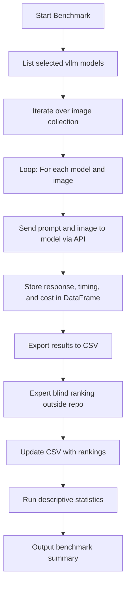

# Image-Based VLM Benchmarking

This document describes the image-based benchmarking functionality for evaluating vision-language models on image understanding tasks.

## Overview

The image benchmarking module allows you to:

1. Run multiple VLM models on a collection of images
2. Collect results in a pandas DataFrame
3. Export results to CSV for human expert ranking
4. Compute descriptive statistics after rankings are added

## Workflow



## Selected Models

The benchmarking uses these specific models by default:

- `google/gemini-2.0-flash-exp:free`
- `openai/gpt-4o-mini`
- `mistralai/pixtral-12b`
- `meta-llama/llama-3.2-90b-vision-instruct`

## Image Types Supported

The benchmark is designed to work with various image types:

- Artworks
- Photographs of objects
- Photographs of archaeological sites
- Scans of newspapers, posters, etc.
- Drawings
- Maps
- Statistical figures and diagrams

## Installation

Ensure you have the required dependencies:

```bash
uv sync
```

This installs pandas along with other required packages.

## Usage

### 1. Run Image Benchmark

```bash
uv run python -m src.benchmarking benchmark-images \
    --image-dir ./path/to/images \
    --output results.csv
```

Options:

- `--image-dir`: Directory containing images (required)
- `--output`: Output CSV file (required)
- `--prompt`: Custom prompt (optional, uses default if not provided)
- `--models`: Comma-separated list of models (optional, uses selected models if not provided)
- `--max-tokens`: Maximum tokens in responses (default: 1000)

### 2. Add Expert Rankings

After running the benchmark, the CSV file will contain columns for `expert_rank` and `expert_notes`.

Open the CSV file and add:

- `expert_rank`: Numeric ranking (1 = best, higher = worse)
- `expert_notes`: Optional notes about the response quality

### 3. Compute Statistics

After adding rankings, compute descriptive statistics:

```bash
uv run python -m src.benchmarking compute-stats \
    --input results.csv \
    --output statistics.csv
```

This generates a summary CSV with per-model statistics including:

- Average response time
- Token usage statistics
- Expert ranking statistics (mean, std, best, worst)

## Python API

You can also use the image benchmarking programmatically:

```python
from pathlib import Path
from src.benchmarking import ImageBenchmark, get_default_prompt

# Initialize
api_key = "your-api-key"
benchmark = ImageBenchmark(api_key)

# Prepare images
image_paths = list(Path("./images").glob("*.jpg"))
image_types = ["artwork"] * len(image_paths)  # Or specific types per image
prompt = get_default_prompt()

# Run benchmark
df = benchmark.benchmark_images(image_paths, image_types, prompt)

# Export to CSV
benchmark.export_to_csv(df, Path("results.csv"))

# After adding rankings, compute statistics
import pandas as pd
df_with_rankings = pd.read_csv("results.csv")
stats = benchmark.compute_statistics(df_with_rankings)
stats.to_csv("statistics.csv", index=False)
```

## CSV Output Format

The benchmark CSV includes these columns:

- `model`: Model identifier
- `image_path`: Full path to the image file
- `image_name`: Image filename
- `image_type`: Category of the image
- `prompt`: Prompt used
- `response`: Model's response
- `response_time_s`: Response time in seconds
- `prompt_tokens`: Tokens in the prompt
- `completion_tokens`: Tokens in the completion
- `total_tokens`: Total tokens used
- `success`: Whether the API call succeeded
- `error`: Error message if failed
- `expert_rank`: Expert ranking (to be filled in)
- `expert_notes`: Expert notes (to be filled in)

## Statistics Output

The statistics CSV includes per-model aggregates:

- `model`: Model identifier
- `total_runs`: Number of successful runs
- `avg_response_time_s`: Average response time
- `std_response_time_s`: Standard deviation of response time
- `min_response_time_s`: Minimum response time
- `max_response_time_s`: Maximum response time
- `avg_total_tokens`: Average tokens used
- `std_total_tokens`: Standard deviation of tokens
- `min_total_tokens`: Minimum tokens
- `max_total_tokens`: Maximum tokens
- `avg_expert_rank`: Average expert ranking
- `std_expert_rank`: Standard deviation of rankings
- `best_rank`: Best (lowest) ranking received
- `worst_rank`: Worst (highest) ranking received

## Example Workflow

```bash
# 1. Set up API key
echo "OPENROUTER_API_KEY=your_key_here" > .env

# 2. Prepare images in a directory
mkdir benchmark_images
# Add your images to this directory

# 3. Run benchmark
uv run python -m src.benchmarking benchmark-images \
    --image-dir ./benchmark_images \
    --output benchmark_results.csv

# 4. Open CSV and add expert rankings
# Edit benchmark_results.csv, fill in expert_rank and expert_notes columns

# 5. Compute statistics
uv run python -m src.benchmarking compute-stats \
    --input benchmark_results.csv \
    --output benchmark_stats.csv

# 6. Review statistics
cat benchmark_stats.csv
```

## Notes

- The default prompt asks for detailed image descriptions including style, content, text, and context
- Image types are inferred from filenames when possible (e.g., "artwork_001.jpg" → "artwork")
- Expert ranking should be done blind (without knowing which model produced each response)
- Lower expert_rank values indicate better performance
- All API calls include timing and token usage tracking for cost analysis
