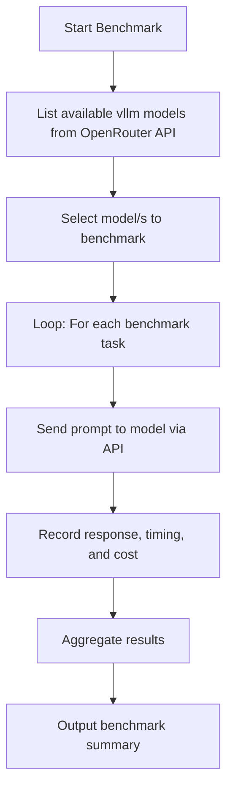

# OpenRouter VLM Benchmarking

This module provides tools for benchmarking vision-language models (VLMs) available through the [OpenRouter API](https://openrouter.ai/). It is designed to evaluate models on tasks related to generating WCAG-compliant alt-text for digital heritage collections.

## Features

- **List Available Models**: Query OpenRouter API to discover available VLM models
- **Benchmark Individual Models**: Run benchmark tasks on a specific model
- **Compare Multiple Models**: Benchmark and compare multiple models simultaneously
- **Pre-defined Task Sets**: Built-in task sets for WCAG alt-text, simple descriptions, and detailed analysis
- **Type-Safe Implementation**: Full type hints throughout the codebase
- **Detailed Metrics**: Track response time, success rate, token usage, and cost

## Architecture



## Installation

### Prerequisites

- Python 3.10 or higher
- OpenRouter API key (get one at [openrouter.ai](https://openrouter.ai/))
- [uv](https://github.com/astral-sh/uv) package manager

### Install Dependencies

```bash
# Install dependencies using uv
uv sync
```

This will install all required dependencies including `click`, `requests`, and `python-dotenv`.

## Configuration

Create a `.env` file in the repository root with your OpenRouter API key:

```bash
OPENROUTER_API_KEY=your_api_key_here
```

You can also use the provided `example.env` as a template:

```bash
cp example.env .env
# Then edit .env to add your API key
```

## Usage

### Command Line Interface

The module can be run as a Python module with several commands:

#### 1. List Available Models

```bash
uv run python -m src.benchmarking list-models
```

List only vision-language models (default):

```bash
uv run python -m src.benchmarking list-models
```

List all models:

```bash
uv run python -m src.benchmarking list-models --all-models
```

#### 2. Benchmark a Single Model

```bash
uv run python -m src.benchmarking benchmark --model "openai/gpt-4-vision-preview"
```

With options:

```bash
uv run python -m src.benchmarking benchmark \
    --model "anthropic/claude-3-opus" \
    --task-set wcag \
    --max-tokens 1000 \
    --output results.json \
    --verbose
```

#### 3. Benchmark Multiple Models

```bash
uv run python -m src.benchmarking benchmark-multiple \
    --models "openai/gpt-4-vision-preview,anthropic/claude-3-opus" \
    --task-set all \
    --output comparison.json
```

### Task Sets

The module includes several pre-defined task sets:

- **`wcag`**: WCAG-compliant alt-text generation tasks (default)
- **`simple`**: Simple one-sentence image descriptions
- **`detailed`**: Comprehensive analysis tasks
- **`all`**: All available tasks combined

### Python API

You can also use the module programmatically:

```python
from src.benchmarking import list_models, benchmark_model, aggregate_results
from src.benchmarking.tasks import get_wcag_alttext_tasks

# Get API key from environment
import os
from dotenv import load_dotenv
load_dotenv()
api_key = os.getenv("OPENROUTER_API_KEY")

# List available models
models = list_models(api_key)
print(f"Found {len(models)} vision models")

# Benchmark a single model
tasks = get_wcag_alttext_tasks()
results = benchmark_model("openai/gpt-4-vision-preview", tasks, api_key)
print(f"Success rate: {results['success_rate']:.1%}")
print(f"Avg response time: {results['avg_response_time_ms']:.2f}ms")

# Benchmark multiple models
all_results = []
for model_name in ["openai/gpt-4-vision-preview", "anthropic/claude-3-opus"]:
    result = benchmark_model(model_name, tasks, api_key)
    all_results.append(result)

# Aggregate results
summary = aggregate_results(all_results)
print(f"Fastest model: {summary['fastest_model']}")
```

## Module Structure

```
src/benchmarking/
├── __init__.py              # Package initialization and exports
├── __main__.py              # CLI entry point
├── cli.py                   # Command-line interface implementation
├── openrouter_benchmark.py  # Core benchmarking logic
├── tasks.py                 # Pre-defined benchmark tasks
└── README.md                # This file
```

## API Reference

### `list_models(api_key: str, filter_vllm: bool = True) -> List[str]`

List available models from OpenRouter API.

**Parameters:**

- `api_key`: OpenRouter API key
- `filter_vllm`: If True, filter to only vision-language models

**Returns:**

- List of model identifiers

### `benchmark_model(model_name: str, tasks: List[Dict], api_key: str, max_tokens: int = 1000) -> Dict`

Benchmark a specific model on a set of tasks.

**Parameters:**

- `model_name`: Model identifier to benchmark
- `tasks`: List of task dictionaries with 'prompt' and optional 'image_url'
- `api_key`: OpenRouter API key
- `max_tokens`: Maximum tokens for model responses

**Returns:**

- Dictionary containing benchmark results with timing and metrics

### `aggregate_results(results: List[Dict]) -> Dict`

Aggregate results from multiple model benchmarks.

**Parameters:**

- `results`: List of benchmark result dictionaries

**Returns:**

- Dictionary with aggregated statistics and rankings

## Example Output

### Single Model Benchmark

```
Benchmarking model: openai/gpt-4-vision-preview
Task set: wcag (5 tasks)
------------------------------------------------------------

Results for openai/gpt-4-vision-preview:
  Total tasks: 5
  Successful: 5
  Failed: 0
  Success rate: 100.0%
  Average response time: 1234.56ms
  Total tokens used: 2500

Detailed results saved to: results.json
```

### Multiple Model Comparison

```
Benchmarking 2 models
Task set: wcag (5 tasks)
------------------------------------------------------------

Benchmarking: openai/gpt-4-vision-preview
  Success rate: 100.0%
  Avg response time: 1234.56ms

Benchmarking: anthropic/claude-3-opus
  Success rate: 100.0%
  Avg response time: 987.65ms

============================================================
SUMMARY
============================================================
Total models benchmarked: 2
Overall success rate: 100.0%
Fastest model: anthropic/claude-3-opus
Slowest model: openai/gpt-4-vision-preview

Model Rankings (by speed):
  1. anthropic/claude-3-opus: 987.65ms (success: 100.0%)
  2. openai/gpt-4-vision-preview: 1234.56ms (success: 100.0%)

Detailed results saved to: comparison.json
```

## Development

### Type Hints

All functions use comprehensive type hints for better IDE support and type checking:

```python
def benchmark_model(
    model_name: str,
    tasks: List[Dict[str, Any]],
    api_key: str,
    max_tokens: int = 1000,
) -> Dict[str, Any]:
    ...
```

### Adding New Task Sets

To add new benchmark tasks, edit `tasks.py`:

```python
def get_custom_tasks() -> List[Dict[str, Any]]:
    return [
        {
            "prompt": "Your custom prompt here",
            "description": "Description of the task",
            "image_url": "https://example.com/image.jpg"  # Optional
        },
        # More tasks...
    ]
```

## Error Handling

The module includes comprehensive error handling:

- API connection errors are caught and reported
- Failed tasks are tracked with error messages
- Success rate metrics help identify problematic models
- Graceful degradation when models are unavailable

## Cost Considerations

Benchmarking VLMs via API can incur costs. Consider:

- Start with small task sets to estimate costs
- Use `--max-tokens` to limit response size
- Monitor token usage in results
- Check OpenRouter pricing for specific models

## Related Research

This benchmarking tool supports the research presented in:

**"Seeing History Unseen: Evaluating Vision-Language Models for WCAG-Compliant Alt-Text in Digital Heritage Collections"**

CHR 2025 Conference

- Moritz Mähr (University of Bern and Basel)
- Moritz Twente (University of Basel)

## License

This code is part of the chr2025-seeing-history-unseen repository and is released under the GNU Affero General Public License v3.0 (AGPL-3.0).

## Support

- 🚨 **Bug Reports**: [GitHub Issue Tracker](https://github.com/maehr/chr2025-seeing-history-unseen/issues)
- 🎁 **Feature Requests**: [GitHub Issue Tracker](https://github.com/maehr/chr2025-seeing-history-unseen/issues)
- 💬 **Questions**: [GitHub Discussions](https://github.com/maehr/chr2025-seeing-history-unseen/discussions)

## References

- [OpenRouter API Documentation](https://openrouter.ai/docs)
- [WCAG 2.2 Guidelines](https://www.w3.org/TR/WCAG22/)
- [Alt Text Best Practices](https://www.a11yproject.com/checklist/)
